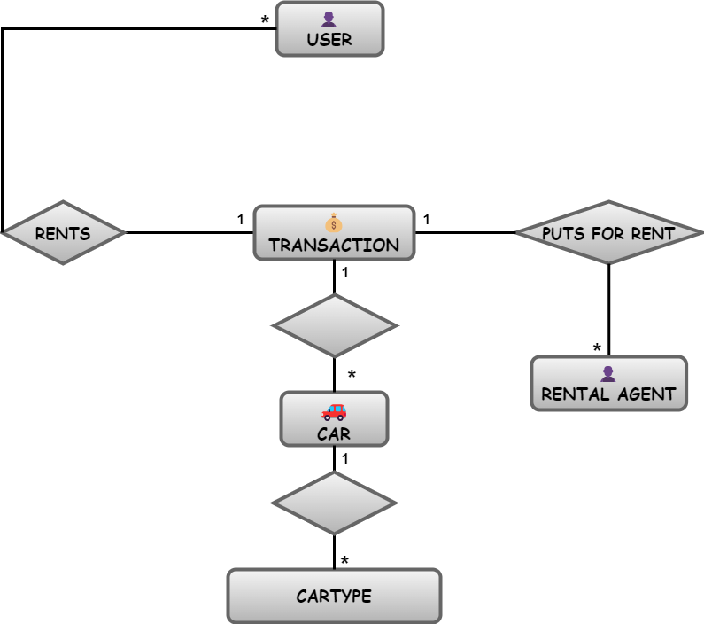

# Rent-A-Car Laravel Application

## Overview
Rent-A-Car is a Laravel application designed to facilitate car rentals. It allows users to register, login, and perform various actions related to car rentals, including browsing cars, managing transactions, managing rental agents, and searching for cars by name. The application includes features such as user roles, controllers, models, Eloquent relationships, migrations, seeders, factories, file uploads, and API routes with authentication and authorization.

## Features
- User Registration and Authentication:
  - Users can register and login to the application.
  - Authentication is managed using Laravel Sanctum.

- User Roles:
  - The application includes multiple user roles: regular user and administrator.
  - Each role has specific permissions and access levels within the application.

- Car Management:
  - Users can view all available cars.
  - Cars can be searched by name.
  - Admins can add, update, and delete cars.
  - Images of cars are stored within the application.

- Rental Agent Management:
  - Users can view all rental agents participating in transactions.
  - Admins can add, update, and delete rental agents.

- Transaction Management:
  - Users can create, update, and delete transactions.
  - Admins can modify the status of transactions.
 
## Eloquent relationships between models in aplication using Entity Relationship Diagram:

  

## Use Cases
1. **User Registration**: New users can register for an account.
2. **User Login**: Registered users can log in to the application.
3. **Administrator Login**: Admins have a separate login interface with extended privileges.
4. **User Logout**: Users can log out of the application.
5. **View All Users**: Admins can view all users registered in the system.
6. **View All Cars**: Users can browse all available cars.
7. **View All Rental Agents**: Users can see a list of all rental agents.
8. **View All Transactions**: Users can see a list of all transactions.
9. **Retrieve Car by ID**: Users can retrieve detailed information about a specific car by its ID.
10. **Retrieve User by ID**: Admins can retrieve detailed information about a specific user by their ID.
11. **Retrieve Agent by ID**: Admins can retrieve detailed information about a specific rental agent by their ID.
12. **Retrieve Transaction by ID**: Users can retrieve detailed information about a specific transaction by its ID.
13. **Search Cars by Name**: Users can search for cars by name.
14. **Create New Transaction**: Users can create a new transaction for renting a car.
15. **Update Transaction**: Users can modify details of an existing transaction.
16. **Delete Transaction**: Users can cancel a transaction.
17. **Create New Agent**: Admins can add a new rental agent to the system.
18. **Update Agent**: Admins can modify details of an existing rental agent.
19. **Delete Agent**: Admins can remove a rental agent from the system.
20. **Update Transaction Status**: Admins can update the status of a transaction.
21. **Create New Car**: Admins can add a new car to the system.
22. **Update Car Details**: Admins can modify details of an existing car.
23. **Delete Car**: Admins can remove a car from the system.

## Technologies Used
- Laravel Framework
- Laravel Sanctum for API authentication
- Eloquent ORM for database interactions
- MySQL database for data storage
- PHP for server-side scripting

## Installation and Setup
1. Clone the repository from GitHub.
2. Install dependencies using Composer (composer update).
3. Set up the database configuration in the `.env` file.
4. Run migrations and seeders to populate the database with initial data (php artisan migrate:fresh --seed).
5. Start the Laravel development server (php artisan serve).
6. Access the application in your web browser.
7. Test the application via Postman where you can copy the routes in the api.php file.

## Acknowledgments
- Laravel Documentation
- Laravel Sanctum Documentation
- Stack Overflow community
- Laravel community
